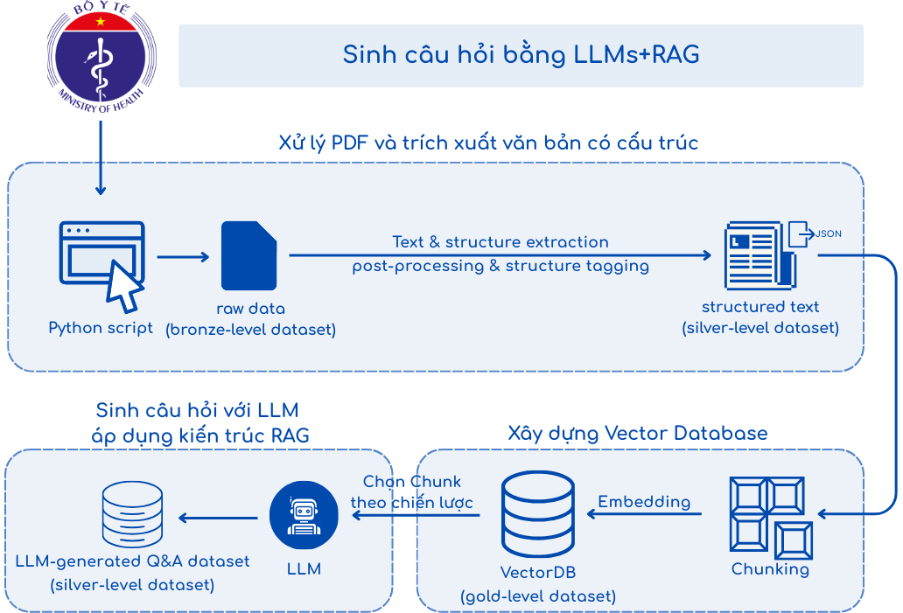

# 🩺 UIT@PubHealthQA — Public Health Q&A with LLMs + RAG

<div align="center">
  
</div>

[](https://opensource.org/licenses/MIT)
[](https://www.python.org/downloads/)


## 📑 Table of Contents
- [Overview](#overview)
- [Key Features](#key-features)
- [Dataset Structure](#dataset-structure)
- [System Architecture (RAG Pipeline)](#system-architecture-rag-pipeline)
- [Installation](#installation)
- [Usage](#usage)
- [Evaluation](#evaluation)
- [Demo](#demo)
- [Project Structure](#project-structure)
- [Acknowledgements](#acknowledgements)
- [License](#license)
- [日本語の説明](#日本語の説明)

## Overview
`UIT@PubHealthQA` is a multi-stage project for building a high-quality Vietnamese public health Question Answering (QA) system and dataset. It combines document acquisition, structured text extraction, and Retrieval-Augmented Generation (RAG) with LLMs to deliver accurate, citation-backed answers grounded in official sources.

Each entry typically includes:
- A user-submitted question (Vietnamese)
- An official answer from the health authority
- Metadata such as category and timestamp

Project goals:
- Make public health regulations accessible in Vietnamese
- Ensure factuality through grounded responses
- Provide a scalable framework for domain-specific QA in Vietnamese

## Key Features

- **Vietnamese-first RAG**: Tailored for public health documents
- **Bronze → Silver → Gold pipeline**: Traceable, auditable data refinement
- **Diverse sources**: Laws, decrees, circulars, official Q&A
- **Web chat UI**: Interactive interface with citations
- **Bloom taxonomy Q&A**: Educational question generation
- **FAISS VectorDB**: Fast semantic search
- **GROQ LLM integration**: High-throughput, low-latency generation

## Dataset Structure

Bronze–Silver–Gold quality tiers:

| Tier | Description |
|------|-------------|
| 🥉 **Bronze** | Raw crawled data from official sources |
| 🥈 **Silver** | Cleaned and structured data with unified schema |
| 🥇 **Gold** | Validated Q&A and an optimized VectorDB for retrieval |

## System Architecture (RAG Pipeline)

The system is implemented as a modular RAG pipeline:

<div align="center">
  
</div>

1. Data acquisition and text/structure extraction
2. Post-processing, tagging, and silver-level JSON output
3. Chunking and embedding
4. VectorDB construction and retrieval
5. LLM generation with grounded context (RAG)

## Installation

### Prerequisites
- Python 3.8+
- Git
- GROQ API key (for LLM access)

### Setup

1. Clone the repository:
   ```bash
   git clone https://github.com/nguyenlong205/uit.PubHealthQA.git
   cd uit.PubHealthQA
   ```

2. (Optional) Create and activate a virtual environment:
   ```bash
   python -m venv venv
   # Windows
   venv\Scripts\activate
   # macOS/Linux
   source venv/bin/activate
   ```

3. Install dependencies:
   ```bash
   pip install -r requirements.txt
   ```

4. Configure GROQ API key:
   ```bash
   python setup_groq_key.py
   ```

5. Prepare directories if needed:
   ```bash
   mkdir -p data/bronze data/silver data/gold logs/question_generation
   ```

## Usage

### Data processing pipeline

1. Ingest policies and QA pairs
   ```bash
   python src/01-pipeline_ingestingPolicy.py
   python src/01-pipeline_ingestingQAPair.py
   ```

2. Preprocess and structure text
   ```bash
   python src/02-pipeline_preprocessing.py
   ```

3. Build VectorDB
   ```bash
   python src/02-pipeline_vectorDB.py
   ```

4. Generate additional questions (optional)
   ```bash
   python src/03-pipeline_generatingQuestion.py
   ```

### Run the web interface

```bash
python app.py
```

Open your browser at `http://localhost:8000`.

## Evaluation

We evaluate retrieval and answer quality using curated topics and metrics. The high-level process of collect → optimize → evaluate is illustrated below.

<div align="center">
  
</div>

## Demo

<div align="center">
  
</div>

- Watch the full walkthrough on YouTube: [https://www.youtube.com/watch?v=JfyAS0z1ZVs](https://www.youtube.com/watch?v=JfyAS0z1ZVs)

## Project Structure

```
UIT@PubHealthQA/
│
├── app/                           # Web application files
│   ├── static/                    # CSS, JavaScript, and images
│   └── templates/                 # HTML templates
│
├── data/                          # Dataset files organized by processing stage
│   ├── bronze/                    # Raw crawled data
│   │   ├── raw_QAPair.csv         # Raw QA pairs from Ministry of Health
│   │   └── raw_Policy.json        # Raw policy documents
│   ├── silver/                    # Cleaned and structured data
│   │   └── Policy.json            # Cleaned policy documents
│   │   
│   └── gold/                      # Vector databases and embeddings
│       ├── db_faiss_phapluat_yte/ # FAISS vector store
│       └──QAPair.csv              #
├── logs/                          # Log files and generated outputs
│   └── question_generation/       # Generated QA pairs
│
├── notebooks/                     # Jupyter notebooks for exploration
│   ├── 01-exploration.ipynb
│   └── 02-cleaning-transform.ipynb
│
├── src/                           # Source code
│   ├── data_acquisition/          # Data collection modules
│   ├── preprocessing/             # Text cleaning and processing
│   │   ├── document_processor.py  # Document cleaning utilities
│   │   ├── text_splitter.py       # Text chunking utilities 
│   │   └── chunking.py            # Chunking strategies
│   ├── utils/                     # Utility functions
│   ├── vector_store/              # Vector database management
│   ├── 01-pipeline_ingestingPolicy.py    # Data collection pipeline
│   ├── 01-pipeline_ingestingQAPair.py    # QA pair collection pipeline
│   ├── 02-pipeline_preprocessing.py      # Data cleaning pipeline
│   ├── 02-pipeline_vectorDB.py           # Vector database creation pipeline
│   └── 03-pipeline_generatingQuestion.py # QA generation pipeline
│
├── tests/                         # Unit and integration tests
├── app.py                         # Main web application
├── requirements.txt               # Python dependencies
├── setup_groq_key.py              # API key setup utility
└── README.md                      # This documentation
```

## Acknowledgements

Advisors:
- Ph.D. Nguyen Gia Tuan Anh — University of Information Technology, VNUHCM
- Ph.D. Duong Ngoc Hao — University of Information Technology, VNUHCM
- T.A. Tran Quoc Khanh — University of Information Technology, VNUHCM

Development team:
- Dung Ho Tan — 23520327@gm.uit.edu.vn
- An Pham Dang — 22520027@gm.uit.edu.vn

With thanks to GROQ for LLM access and tooling support.

## License

MIT License. See `LICENSE` for details.

---

## 日本語の説明

### プロジェクト概要
`UIT@PubHealthQA` は、ベトナム語の公衆衛生分野に特化した質問応答（QA）システム／データセットです。公式文書の取得・構造化と、RAG（Retrieval-Augmented Generation）を組み合わせ、根拠付きで正確な回答を生成します。

目的：
- ベトナム語で公衆衛生の規程・手続きを分かりやすく提供
- 公式文書に基づく根拠提示で正確性を担保
- ドメイン特化型QAのスケーラブルな枠組みを提供

### 主な特徴
- ベトナム語ドメイン向けRAG
- Bronze→Silver→Gold の段階的パイプライン
- 法令・通達・公式Q&Aなど多様なソース
- 引用表示付きのWebチャットUI
- Bloom分類に基づく設問生成
- FAISSベースの高速ベクトル検索
- GROQ LLMの統合

### データ層（Bronze / Silver / Gold）
| 層 | 説明 |
|----|------|
| 🥉 Bronze | 公式ソースから収集した生データ |
| 🥈 Silver | クリーニング・構造化済みの統一スキーマ |
| 🥇 Gold | 検証済みQ&Aと最適化されたVectorDB |

### システム構成（RAGパイプライン）
<div align="center">
  
</div>

1) 取得・抽出 → 2) 後処理・タグ付け → 3) チャンク化と埋め込み → 4) VectorDB 構築 → 5) LLM生成（RAG）

### セットアップ手順
```bash
git clone https://github.com/nguyenlong205/uit.PubHealthQA.git
cd uit.PubHealthQA
python -m venv venv
venv\Scripts\activate   # Windows（macOS/Linux: source venv/bin/activate）
pip install -r requirements.txt
python setup_groq_key.py
```

### 使い方（パイプライン）
```bash
python src/01-pipeline_ingestingPolicy.py
python src/01-pipeline_ingestingQAPair.py
python src/02-pipeline_preprocessing.py
python src/02-pipeline_vectorDB.py
# 任意:
python src/03-pipeline_generatingQuestion.py
```

### Webインターフェースの起動とデモ
```bash
python app.py
```
ブラウザで `http://localhost:8000` を開いてください。

<div align="center">
  
</div>

動画デモ（YouTube）: [https://www.youtube.com/watch?v=JfyAS0z1ZVs](https://www.youtube.com/watch?v=JfyAS0z1ZVs)

評価プロセス（収集→最適化→評価）の図：
